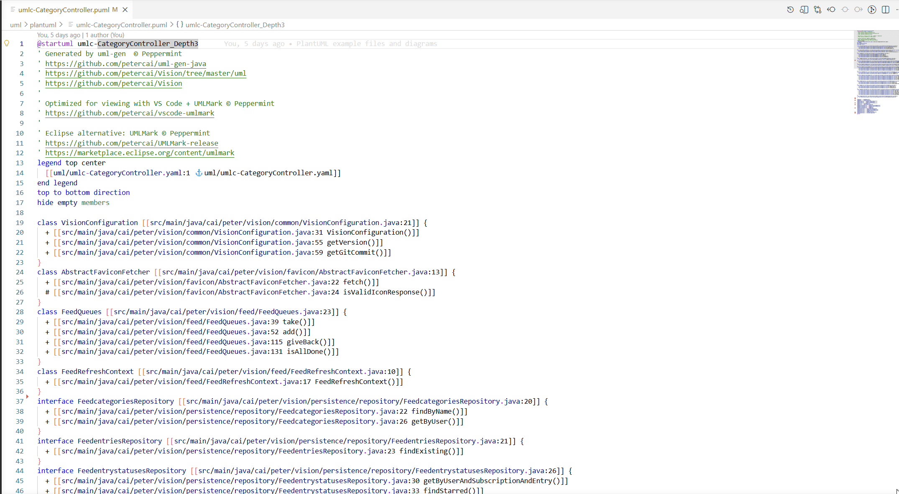
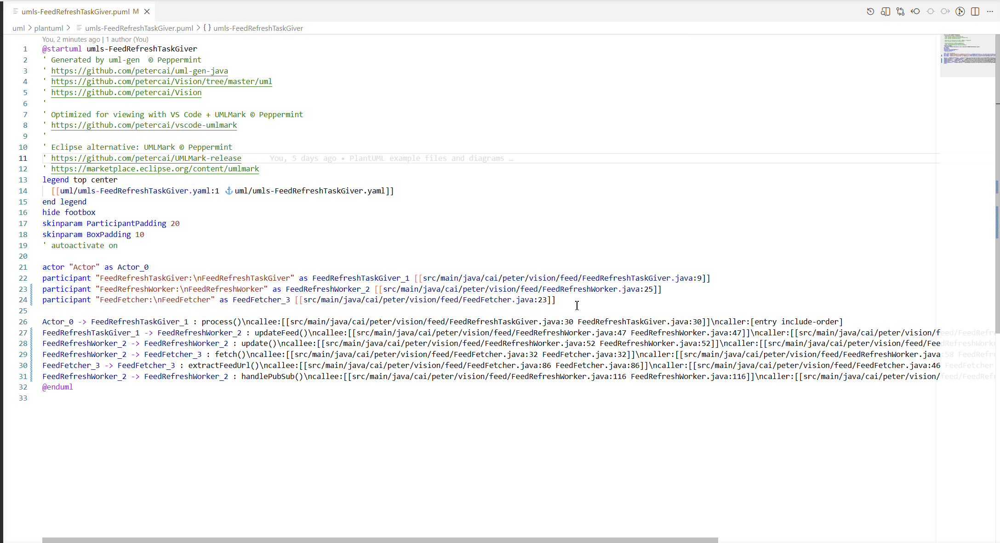

# UMLMark for Visual Studio Code

PlantUML authoring, preview, code navigation, and export in one tool.

UMLMark helps teams keep diagrams and source code aligned by turning PlantUML files
into an interactive development surface: write code, generate PlantUML, preview instantly,
navigate back to real source files, and export production-ready artifacts.

<p align="center">
  <a href="https://marketplace.visualstudio.com/items?itemName=petercai.umlmark"></a>
  <a href="https://marketplace.visualstudio.com/items?itemName=petercai.umlmark"></a>
  <a href="https://github.com/petercai/vscode-umlmark/stargazers"></a>
  
</p>

## Why UMLMark

Most diagram workflows break in at least one place:

- Diagram preview is disconnected from source code changes.
- Navigation from diagram elements back to real code is slow or brittle.
- Exporting shareable artifacts is repetitive and error-prone.

UMLMark addresses these problems directly:

- Fast PlantUML preview with practical zoom and pan controls.
- Source-code navigation from diagram hyperlinks inside VS Code.
- One-tool export flow for workspace, document, and current diagram.
- Flexible rendering via Local or PlantUML Server modes.

## Key Capabilities

- Open PlantUML preview with `Alt+D` (`Option+D` on macOS).
- Auto-update preview while editing.
- Zoom and pan controls for large diagrams.
- Source-code navigation using UML class or sequence diagrams
- Export commands:
  - `umlmark.exportCurrent`
  - `umlmark.exportDocument`
- URL utilities:
  - `umlmark.URLCurrent`
  - `umlmark.URLDocument`

## Supported File Types

`*.wsd`, `*.pu`, `*.puml`, `*.plantuml`, `*.iuml`

## Preview and Navigation Demos

Preview interaction (zoom, pan, control bar actions):


Code navigation from PlantUML hyperlinks:

- Class diagram navigation:
  
- Sequence diagram navigation:
  

## Install

### From VS Code Marketplace

- Open Extensions in VS Code.
- Search for `UMLMark`.
- Install the extension published by `petercai`.

Direct link:

- <https://marketplace.visualstudio.com/items?itemName=petercai.umlmark>

### CLI Install

```bash
code --install-extension petercai.umlmark
```

## Quick Start

1. Open a `.puml` (or other supported PlantUML) file.
2. Press `Alt+D` (`Option+D` on macOS) to open preview.
3. Edit diagram code and observe live updates.
4. Use embedded hyperlinks to jump between diagram and source code.
5. Export outputs from command palette via:
   `umlmark.exportCurrent`, `umlmark.exportDocument`.

## Developer Flow (UMLMark Suite)

Recommended end-to-end workflow for Design as Code / Architecture as Code:

1. Write or update source code.
2. Generate PlantUML diagrams from source using UML Gen (CLI).
3. Open generated `.puml` diagrams in UMLMark preview.
4. Navigate from diagram elements back to source files.
5. Iterate: update source, regenerate diagrams, and re-verify in preview.

Flow summary:

`source code -> uml-gen generation -> .puml preview in UMLMark -> code navigation back -> iterate`

## Rendering Modes

UMLMark supports two rendering modes:

- `Local` (default)
- `PlantUMLServer`

### Local Render Requirements

- Java runtime
- Graphviz

Quick install on macOS:

```bash
brew install --cask temurin
brew install graphviz
```

### PlantUMLServer Render

Use this mode when you want faster export/preview throughput and have a PlantUML
server available.

Example settings:

```json
"umlmark.server": "http://localhost:8080",
"umlmark.render": "PlantUMLServer"
```

Note: for large diagrams with includes, server `POST` support is recommended to avoid
`414 URI Too Long` errors.

## Configuration Highlights

Commonly used settings:

- `umlmark.render`
- `umlmark.server`
- `umlmark.previewAutoUpdate`
- `umlmark.diagramsRoot`
- `umlmark.exportOutDir`
- `umlmark.exportFormat`
- `umlmark.includepaths`

Typical project layout:

```json
"umlmark.diagramsRoot": "uml/plantuml",
"umlmark.exportOutDir": "uml"
```

## Ecosystem: UMLMark Suite

Together, these tools support a full code-to-architecture workflow:

| Tool | Role |
| --- | --- |
| [UML Gen (CLI)](https://github.com/petercai/uml-gen-java) | Generate class and sequence diagrams from source code |
| [UMLMark (VS Code Extension)](https://github.com/petercai/vscode-umlmark) | Interactive PlantUML preview, code navigation, export |
| [UMLMark (Eclipse Plugin)](https://github.com/petercai/UMLMark-release) | UML generation and usage inside Eclipse |

## License

This project follows a dual-license model across the UMLMark Suite.

- Free for Non-Commercial Use: [LICENSE.txt](LICENSE.txt)
- Commercial Use Requires License: [COMMERCIAL_LICENSE.txt](COMMERCIAL_LICENSE.txt)

If you need commercial usage guidance for your deployment scenario, contact the maintainer.

## Support

If UMLMark helps your team, support the project here:
- Support me: <https://paypal.me/petercaica>


## For Contributors

Useful local commands:

```bash
# install dependencies
npm install

# compile code
./node_modules/.bin/tsc -p .
# OR use the package.json script
npm run compile

# Package the extension
npx @vscode/vsce package

# Install the .vsix file
code --install-extension umlmark-1.0.5.vsix
```

Issue tracker:

- <https://github.com/petercai/vscode-umlmark/issues>

