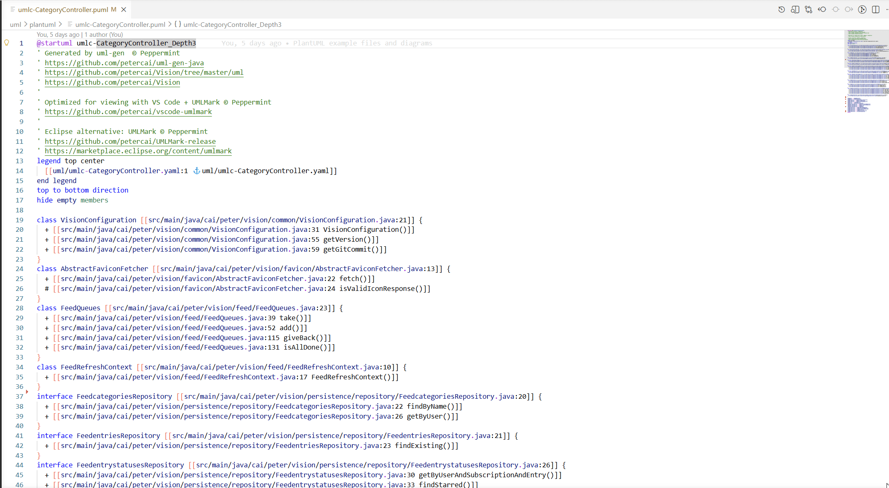
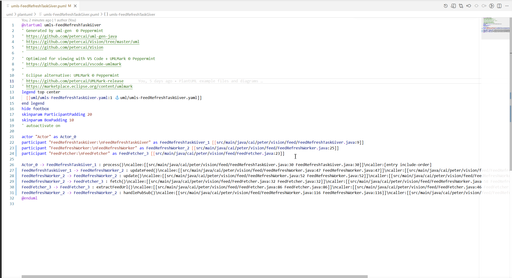
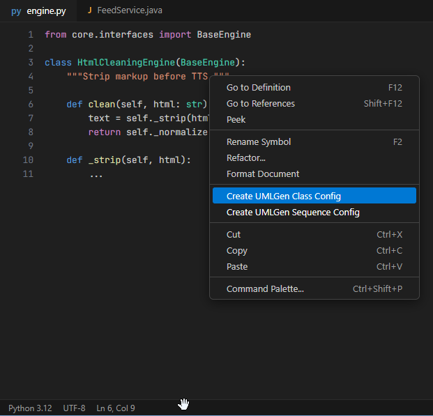
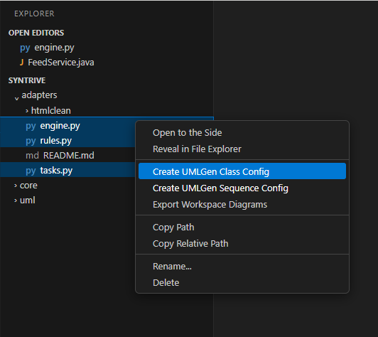

# UMLMark for Visual Studio Code

UMLMark turns source code into navigable class and sequence diagrams inside VS Code, so architecture stays reviewable even when AI writes code faster than teams can read it.

UMLMark makes VS Code a complete workspace for code-to-architecture review:

- **Configure**: right-click a `.py`, `.java` or `.ts` file and choose **Create UMLGen Class Config** or **Create UMLGen Sequence Config** to get a ready-to-run diagram config in `uml/`.
- **Generate**: right-click a diagram config and choose **Generate UML Diagram** to produce class and sequence diagrams directly from your codebase.
- **Explore**: preview diagrams live, click any element to jump to its source, and export shareable artifacts for reviews and documentation.

<p align="center">
  <a href="https://marketplace.visualstudio.com/items?itemName=petercai.umlmark"></a>
  <a href="https://marketplace.visualstudio.com/items?itemName=petercai.umlmark"></a>
  <a href="https://github.com/petercai/vscode-umlmark/stargazers"></a>
  
</p>

## Why UMLMark

With AI-assisted development, the bottleneck has moved from writing code to
understanding it. Line-by-line review rarely reveals structural change: new
dependencies, shifted responsibilities, or altered call paths. Typical diagram
workflows fall short in three ways:

- **Drift**: hand-maintained diagrams fall out of sync with the code they describe.
- **Disconnection**: diagrams are static images with no path back to the implementing source.
- **Friction**: rendering and exporting diagrams for reviews and documentation is manual and repetitive.

UMLMark closes these gaps with a single code-to-diagram workflow:

- **Generated from source**: class and sequence diagrams are derived from the code, so they reflect what is actually built.
- **Traceable**: every diagram element links back to its source location in VS Code.
- **Live**: the preview updates as you edit, with zoom and pan for large diagrams.
- **Shareable**: export the current diagram, a document, or the whole workspace in one step, rendered locally or through a PlantUML server.

## Key Capabilities

- Create a UMLGen class or sequence config from selected source files via the
  **Create UMLGen Class Config** / **Create UMLGen Sequence Config** context menus.
- Generate class and sequence diagrams from source code via the
  **Generate UML Diagram** context menu on a `.yaml` diagram config.
- Open PlantUML preview with `Alt+D` (`Option+D` on macOS).
- Auto-update preview while editing.
- Zoom and pan controls for large diagrams.
- Source-code navigation using UML class or sequence diagrams
- Export commands:
  - `umlmark.exportCurrent`
  - `umlmark.exportDocument`
- URL utilities:
  - `umlmark.URLCurrent`
  - `umlmark.URLDocument`

## Supported File Types

`*.wsd`, `*.pu`, `*.puml`, `*.plantuml`, `*.iuml`

## Preview and Navigation Demos

Preview interaction (zoom, pan, control bar actions):


Code navigation from PlantUML hyperlinks:

- Class diagram navigation:
  
- Sequence diagram navigation:
  

## Install

### From VS Code Marketplace

- Open Extensions in VS Code.
- Search for `UMLMark`.
- Install the extension published by `petercai`.

Direct link:

- <https://marketplace.visualstudio.com/items?itemName=petercai.umlmark>

### CLI Install

```bash
code --install-extension petercai.umlmark
```

## Quick Start

1. Open a `.puml` (or other supported PlantUML) file.
2. Press `Alt+D` (`Option+D` on macOS) to open preview.
3. Edit diagram code and observe live updates.
4. Use embedded hyperlinks to jump between diagram and source code.
5. Export outputs from command palette via:
   `umlmark.exportCurrent`, `umlmark.exportDocument`.

## Create UMLGen Configs

A UMLGen config is a `.yaml` file that tells the generator which source files
to read and which diagram to draw. Instead of writing one by hand, right-click
your source code and let UMLMark create it.

### From the editor

Right-click inside a `.py`, `.java` or `.ts` file and choose
**Create UMLGen Class Config** or **Create UMLGen Sequence Config**.



- **Class config**: covers the whole file.
- **Sequence config**: uses the method or function under the cursor as the
  entry point, so place the cursor inside the method you want to trace first.
  The config name includes the method, for example `engine-clean-seq.yaml`.

### From the Explorer

Select one or more source files in the Explorer, right-click, and choose the
same commands. All selected files go into a single config.



- The first selected file sets the language and the config name.
- Folders, unsupported files, and files in another language or workspace
  folder are skipped; a warning lists them and **Output › UMLMark** shows details.

### What gets created

- `uml/<name>-cls.yaml` or `uml/<name>-seq.yaml`, opened in the editor so you
  can review it. The diagram is written to `uml/<name>-cls.puml` (or `-seq.puml`).
- `uml/filter-v3.yaml` and `uml/parsers.lock.yaml` support files, copied once.
- Existing files are never overwritten. Running the command again on the same
  source opens the existing config. If the name belongs to a different source,
  UMLMark adds the parent folder to the name, for example `adapters-engine-cls.yaml`.

When the config is ready, choose **Generate Now** in the notification, or
right-click the `.yaml` file and choose **Generate UML Diagram**.

> TypeScript configs can be created today, but UMLGen does not generate
> diagrams from TypeScript yet.

## Developer Flow (UMLMark Suite)

Recommended end-to-end workflow for Design as Code / Architecture as Code:

1. Once: clone [uml-gen](https://github.com/petercai/uml-gen-java), create its `.venv`, and set `umlmark.umlgen.sourcePath` (and `umlmark.umlgen.venvPath` if the venv lives elsewhere).
2. Write or update source code.
3. Right-click the source files and choose **Create UMLGen Class Config** or **Create UMLGen Sequence Config** (once per diagram). In the editor, the sequence command uses the method under the cursor as the entry point.
4. Choose **Generate Now**, or right-click the `.yaml` diagram config and choose **Generate UML Diagram**. The command runs in a dedicated **UMLGen** terminal.
5. Open generated `.puml` diagrams in UMLMark preview.
6. Navigate from diagram elements back to source files.
7. Iterate: update source, regenerate diagrams, and re-verify in preview.

Flow summary:

`source code -> Create UMLGen Config -> Generate UML Diagram -> .puml preview in UMLMark -> code navigation back -> iterate`

## Rendering Modes

UMLMark supports two rendering modes:

- `Local` (default)
- `PlantUMLServer`: renders remotely via `umlmark.server`, no local Java or
  Graphviz needed (see [Configuration Highlights](#configuration-highlights))

### Local Render Requirements

- Java runtime
- Graphviz
- plantuml.jar

#### Quick install on Windows:

```
@REM Chocolatey package manager
choco install temurin
choco install graphviz

@REM Windows package manager (winget)
winget install EclipseAdoptium.Temurin.21.JDK
winget install Graphviz.Graphviz
```

#### Quick install on macOS:

```bash
brew install --cask temurin
brew install graphviz
```

#### Download plantuml.jar from https://plantuml.com/download

## Configuration Highlights

Recommended VS Code configuration (`settings.json`):

```jsonc
{
  "umlmark.jar": "c:\\app\\plantuml-1.2026.6.jar",
  "umlmark.exportFormat": "png",
  "umlmark.exportIncludeFolderHeirarchy": false,
  "umlmark.exportOutDir": "uml",
  "umlmark.exportSubFolder": false,
  "umlmark.render": "Local"
}
```

| Setting | Purpose | Notes |
| --- | --- | --- |
| `umlmark.jar` | Path to an alternate `plantuml.jar`. | Leave blank to use the version bundled with the extension. Set this to pin a specific PlantUML release. |
| `umlmark.exportFormat` | Default export format (`png`, `svg`, `pdf`, `eps`, ...). | Leave blank to be prompted for a format on every export. |
| `umlmark.exportIncludeFolderHeirarchy` | Preserve the source folder structure under the root when exporting. | Set to `false` for a flat output layout, as shown above. |
| `umlmark.exportOutDir` | Output directory for exported diagrams. | Path is relative to the workspace folder. |
| `umlmark.exportSubFolder` | Export each diagram into a subfolder named after its host file. | Set to `false` to export all diagrams directly into `exportOutDir`. |
| `umlmark.render` | Rendering engine used for preview and export. | `Local` requires Java + Graphviz (see [Local Render Requirements](#local-render-requirements)); `PlantUMLServer` renders remotely via `umlmark.server`. |
| `umlmark.java` | Java executable location. | Defaults to `java` on `PATH`; override if Java isn't globally available. |
| `umlmark.server` | PlantUML server URL. | Required when `umlmark.render` is `PlantUMLServer`, e.g. `https://www.plantuml.com`. |
| `umlmark.umlgen.sourcePath` | Local uml-gen checkout. | Required by **Generate UML Diagram** / **Generate Now**. `~` expands to the home folder. |
| `umlmark.umlgen.venvPath` | UMLGen virtual environment. | Defaults to `<sourcePath>/.venv`. Java configs run the generator from it; Python configs install uml-gen into the project `.venv`/`venv` (via `uv`, else `pip`) and run it there, falling back to this venv. |

> Tip: `umlmark.java`, `umlmark.jar`, `umlmark.server`, `umlmark.includepaths`, `umlmark.commandArgs`, `umlmark.jarArgs`, `umlmark.umlgen.sourcePath`, and `umlmark.umlgen.venvPath` are restricted in untrusted workspaces for security.


## Ecosystem: UMLMark Suite

Diagram generation is built into UMLMark for VS Code. The same generation engine is also available as a standalone CLI for scripting and CI:

| Component | Role |
| --- | --- |
| [UML Gen (CLI)](https://github.com/petercai/uml-gen) | Generate class and sequence diagrams from source code |
| [UMLMark for VS Code](https://github.com/petercai/vscode-umlmark) | Interactive PlantUML preview, code navigation, export |

## License

This project follows a dual-license model across the UMLMark Suite.

- Free for Non-Commercial Use: [LICENSE.txt](LICENSE.txt)
- Commercial Use Requires License: [COMMERCIAL_LICENSE.txt](COMMERCIAL_LICENSE.txt)

If you need commercial usage guidance for your deployment scenario, contact the maintainer.

## Support

If UMLMark helps your team, support the project here:
- Support me: <https://paypal.me/petercaica>


## For Contributors

Useful local commands:

```bash
# install dependencies
npm install

# compile code
./node_modules/.bin/tsc -p .
# OR use the package.json script
npm run compile

# Package the extension
npx @vscode/vsce package

# Install the .vsix file
code --install-extension umlmark-1.1.0.vsix
```

Issue tracker:

- <https://github.com/petercai/vscode-umlmark/issues>

